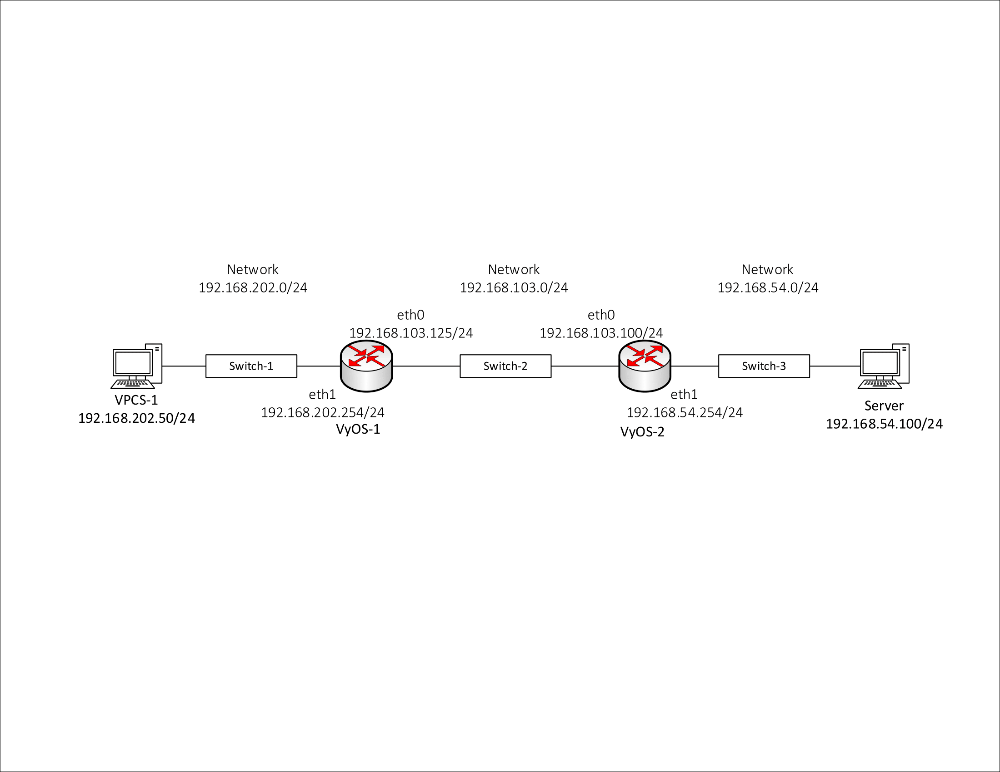

# Lab 3 Pre-Lab Notes

## ECT Tech Nugget - N4.0 - VyOS and GNS3 - Part 1

### What is VyOS?

- VyOS is a Debian Linux based router. It uses a common command line interface to do configuration
- Several other major companies use the same (or very similar) CLI commands to configure their equipment
- For example Juniper's JunOS and Ubituiti's EdgeRouter product lines (Not CISCO)
- VyOS has a great online resource for it's commands <https://wiki.vyos.net/wiki/User_Guide>

**Network Diagram - keep it handy**

### Setting up VyOS in GNS3

Server is also a VPCS
Leave Space between items in GNS3

#### Connections

| Device A | Port A | Device B | Port B |
| -------- | ------ | -------- | ------ |
| VPCS-1   | e0     | Switch-1 | e0     |
| Switch-1 | e1     | VyOS-1   | e1     |
| VyOS-1   | e0     | Switch-2 | e0     |
| Switch-2 | e1     | VyOS-2   | e0     |
| VyOS-2   | e1     | Switch-3 | e0     |
| Switch-3 | e1     | Server   | e0     |

***For VyOS, GNS3 opens kvm consoles --> Ignore these, you want to use Oracle VirtualBox Consoles***

*Right Control Button frees mouse from window*

### Working VyOS's Command Line Interface (CLI)

`ip ARG ... [OPTION]`
: Configures ip

`ip X.X.X.X/Y Z.Z.Z.Z`
: Configures ip with gateway

Help Menu
: `?` opens help menu, `[COMMAND] ?` gives help for that command
: `:` means list extends past screen
: Space gets out of list
: Enters goes down next line in list
: Escape (unsure) exits back to command line

`show config`
: Shows config file off the disk that is running for VyOS
: Services section shows if SSH service is running
: its-class user section shows who we logged in as
: More sections will get added as we add things to the route

Tab Completion
: Hitting tab after typing a part of a string will list all commands that start with that string
: Will autofill command prompt if there is only one match

Configure Mode
: Enter configure mode with the `configure` command
: Must be in configure mode to make changes to router
: You can tell if you're in configure mode if the `$` changes into a `#`
: The `show config` disappears when in configure mode -> the `show` command will show the active running config *which is different from the one on disk*

`set interfaces ethernet [PORT_NAME]`
: Tab completion will show all available options

`set interfaces ethernet [PORT_NAME] address [IP/SUB]`
: Sets the IP and Subnet Mask of the port (ex. eth1)
: A plus on the left hand side means something has been changed but not committed

`commit`
: Commits changes (gets rid of plus sign)

## ECT Tech Nugget - N4.0 - VyOS and GNS3 - Part 2
